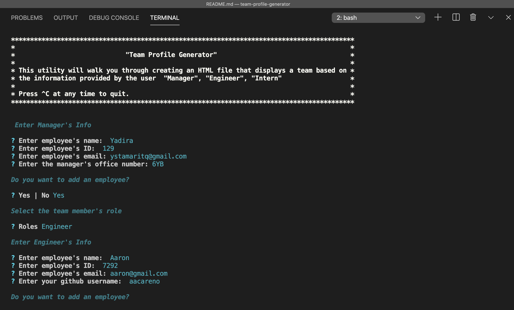
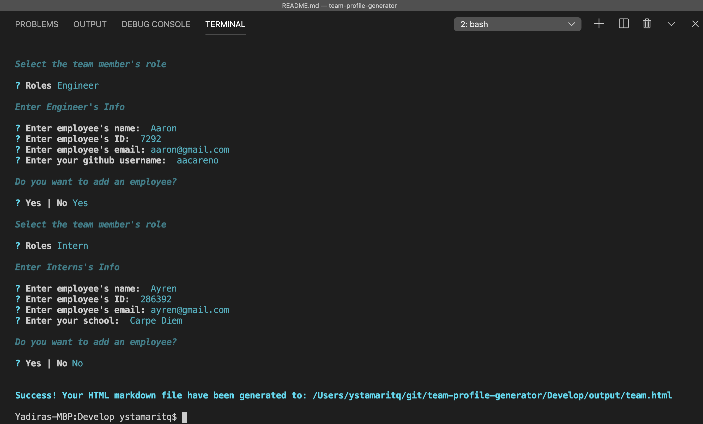

# Team Profile Generator


[](https://github.com/ystamaritq/team-profile-generator/blob/master/LICENSE)

> HTML webpage that displays summaries for each team member.
> <br>

</div>

---

### Table of Contents

- [Description](#description)
- [User Stories](#user-stories)
- [Installing / Getting Started](#inslalling-/-getting-started)
  - [MVP](#mvp)
  - [Test](#test)
- [Demo](#demo)
- [Project Board](https://github.com/ystamaritq/team-profile-generator/projects "team-profile-generator")
- [Github Link](https://github.com/ystamaritq/team-profile-generator "github-project-link")

---

## Description

a software engineering team generator command line application (CLI). The application will prompt the user for information about the team manager and then information about the team members.

---

## User Stories

`As a manager I want to generate a webpage that displays my team's basic info so that I have quick access to emails and GitHub profiles`

---

### Installing / Getting Started

To test this project, simply follow these steps:

```
step 1: clone https://github.com/ystamaritq/team-profile-generator.git
step 2: install node https://nodejs.org/en/download/
step 3: npm install
step 4: node app.js

```

---

#### Initial Configuration

No additional setup required.

#### Developing

Below is a summary of the key files for this project and their purpose:

- **app.js** main application entry point
- **package.json** - node package definition
- **Develop/css** - css used by the project
- **Develop/lib** - utilities classes, prompts and utils js files
- **Develop/test** - test cases used by the project
- **Develop/templates** - HTML utilities templates used to generate the webpage

---

#### MVP

- Creating the Classes: `Employee`, `Manager`, `Engineer` ,`Intern`.
- The tests for these classes in the `tests` directory must all pass.
- The project must generate a `team.html` page in the `output` directory, that displays a nicely formatted team roster. Each team member should display the following in no particular order:

  - Name

  - Role

  - ID

  - Role-specific property (School, link to GitHub profile, or office number)

---

### Test

Image that demonstrates all unit tests pass.


#### Demo

#### - The following video demonstrates the application functionality:

[Team Profile Generator Video _Click Me_](https://github.com/ystamaritq/team-profile-generator)

##### CLI Images:





---

## Licensing

"The code in this project is licensed under MIT license."

---

**developed with love by **@ystamaritq\*\*\*\*

[Table of Contents](#table-of-contents)
